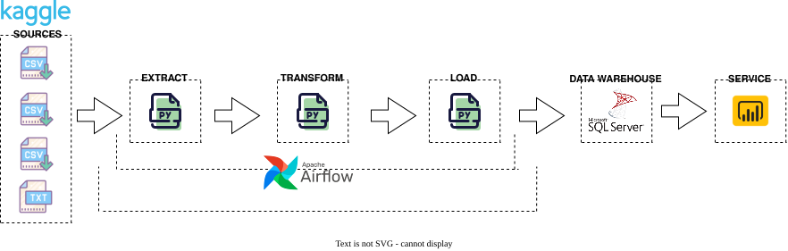
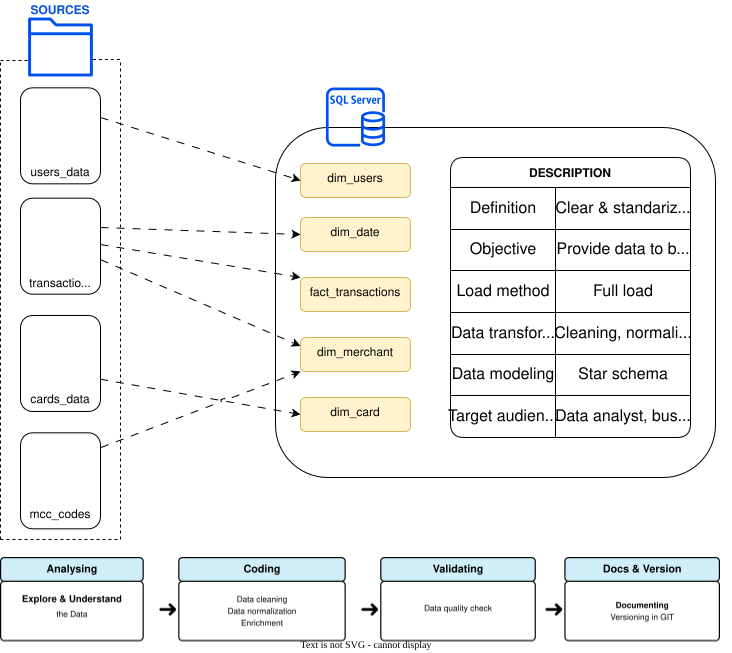
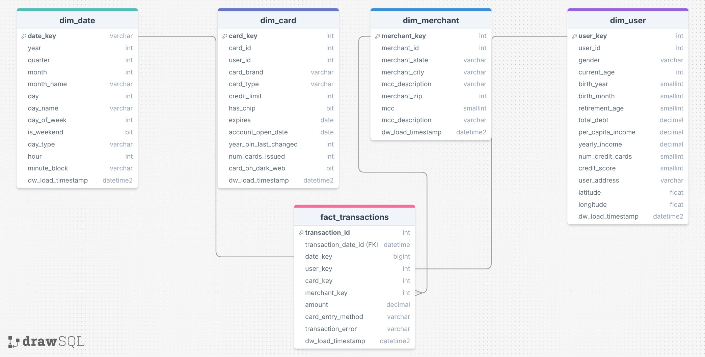

# 💳 Financial Transactions Data Warehouse Pipeline

   

---

## 📖 Overview
This project implements a robust, end-to-end data warehouse pipeline for financial transactions. The pipeline covers data ingestion, transformation, quality checks, dimensional modeling (star schema), and business intelligence visualization. It leverages Dockerized Apache Airflow for orchestration, SQL Server for the data warehouse, Python for ETL and automation, and Power BI for reporting.

**Key Features:**
- Automated ETL orchestration with Airflow (Docker)
- Data warehouse built on SQL Server (star schema)
- Python Notebooks for EDA
- Python scripts for data extraction, transformation, and loading
- Data quality checks and indexing strategies
- Interactive analytics and dashboards in Power BI

---

## 🏗️ Architecture



---

## 🔗 Data Lineage



---

## 🌟 Data Model (Star Schema)



---


## 📦 Project Structure

```bash
├── catalog/                         # Architecture & lineage diagrams
│   ├── data_architecture.svg
│   ├── data_lineage.svg
│   └── star_dw_model.png
│
├── data/                            # Input datasets (raw/reference)
│   ├── cards_data.parquet
│   ├── mcc_codes.json
│   ├── transactions_data.parquet
│   └── users_data.parquet
│
├── docker/
│   └── airflow/                     # Airflow environment
│       ├── dags/                    # ETL DAG definitions
│       │   ├── etl_dim_card_dag.py
│       │   ├── etl_dim_date_dag.py
│       │   ├── etl_dim_merchant_dag.py
│       │   ├── etl_dim_users_dag.py
│       │   ├── etl_fact_transactions_dag.py
│       │   └── test_group_dag.py
│       ├── .dockerignore
│       ├── Dockerfile
│       ├── docker-compose.yaml
│       └── requirements.txt
│
├── scripts/
│   ├── ETL/                         # Transformation logic
│   │   ├── __init__.py
│   │   ├── config.py
│   │   ├── extract_data.py
│   │   ├── load_data.py
│   │   ├── transform_dim_card.py
│   │   ├── transform_dim_date.py
│   │   ├── transform_dim_merchant.py
│   │   ├── transform_dim_users.py
│   │   ├── transform_fact_transactions.py
│   │   └── utils.py
│   │
│   ├── EDA_cards_data.ipynb
│   ├── EDA_date_data.ipynb
│   ├── EDA_merchant_data.ipynb
│   ├── EDA_transactions_data.ipynb
│   └── EDA_users_data.ipynb
│
├── sql/                             # Data warehouse DDL & quality checks
│   ├── Create FinancialDW.sql
│   ├── dim_cards_data_quality_check.sql
│   ├── dim_date_data_quality_check.sql
│   ├── dim_merchant_data_quality_checkk.sql
│   ├── dim_users_data_quality_check.sql
│   ├── fact_transactions_data_quality_check.sql
│   ├── index_strategy.sql
│   └── partitioning_strategy.sql
│
├── visualization_PBI/               # Power BI semantic model & report
│   ├── financial_transactions_BI.Report/
│   ├── financial_transactions_BI.SemanticModel/
│   └── financial_transactions_BI.pbip
│
├── logs/
├── requirements.txt
└── README.md
```

---

---


## 🛠️ Setup Instructions

### 1. Clone the Repository
```bash
git clone <your-repo-url>
cd "Financial Transactions Project"
```

### 2. Set Up Python Environment
```bash
python -m venv financial_transaction_project
# Activate the environment (Windows)
financial_transaction_project\Scripts\activate
pip install -r requirements.txt
```

### 3. Download the Dataset
This project uses the Transactions Fraud Dataset from Kaggle.

**Option 1: Using Python (kagglehub)**
```python
import kagglehub
path = kagglehub.dataset_download("computingvictor/transactions-fraud-datasets")
print("Path to dataset files:", path)
```

**Option 2: Using Kaggle CLI**
```bash
pip install kaggle
kaggle datasets download -d computingvictor/transactions-fraud-datasets
unzip transactions-fraud-datasets.zip -d data/
```

---


## 🔄 Pipeline Process Details

### 1. Data Ingestion & Staging
- Raw data (transactions, cards, users, merchants) is placed in the `data/` folder.
- Python scripts in `scripts/ETL/` handle extraction and initial cleaning.

### 2. Orchestration with Airflow (Docker)
- Airflow is containerized using Docker Compose (`docker/airflow/`).
- ETL DAGs automate the loading and transformation of each dimension and fact table.
- Each DAG runs Python scripts and SQL tasks as pipeline steps.

### 3. Data Warehouse (SQL Server)
- The warehouse schema is defined in `sql/Create FinancialDW.sql` (star schema: fact + dimensions).
- Python and SQL scripts create tables, indexes, and partitions.
- Data quality checks are implemented via dedicated SQL scripts.

### 4. Transformation & Loading
- Python ETL scripts transform raw data into dimension and fact tables.
- Data is loaded into SQL Server using Python
- Partitioning and indexing strategies optimize performance.

### 5. Data Quality & Validation
- SQL scripts in `sql/` check for duplicates, nulls, referential integrity, and business rules.


### 6. Dimensional Modeling (Star Schema)
- The warehouse follows a star schema: one fact table (transactions) and several dimensions (cards, users, merchants, date).
- See `catalog/star_dw_model.png` for the model diagram.

### 7. Business Intelligence & Visualization
- Power BI project (`visualization_PBI/`) connects to the warehouse for reporting.
- Pre-built dashboards and semantic models enable interactive analytics.

---

---


## 🐛 Troubleshooting
- Ensure all Python dependencies are installed in your virtual environment.
- For Airflow issues, check logs in `logs/` and Docker container logs.
- For SQL Server issues, verify connection strings and database status.
- For dataset download issues, verify your Kaggle API credentials.

---

---


## 📜 License
This project is licensed under the MIT License.

